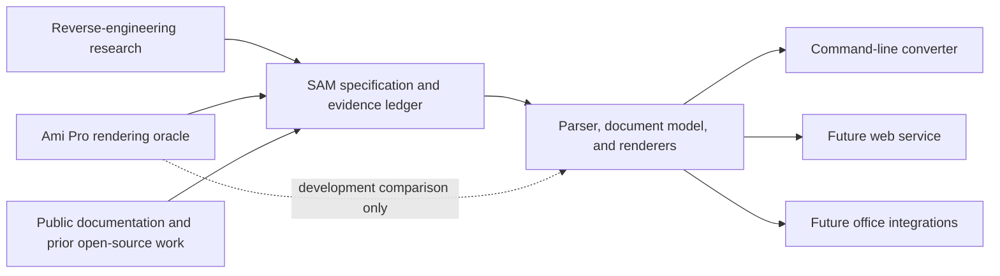

# Repository architecture

The project is a preservation toolkit with several related components, not one
monolithic converter. Its durable boundary is the SAM format specification and a
safe document model; the oracle and research components supply evidence, while the
converter and future integrations consume it.



The dashed edge is a development feedback loop, not a production dependency. Ami Pro,
the emulator environment, private corpora, and proprietary media must never be needed
to install or run the converter.

## Present layout

| Path | Ownership |
|---|---|
| `src/amipro_sam/` | Converter parser, intermediate model, safety limits, assets, and output renderers |
| `src/amipro_oracle/` | Local oracle controller and evidence capture |
| `scripts/amipro-oracle`, `scripts/build-oracle-toolchain`, `toolchain/` | Oracle entry points and hermetic toolchain |
| `tools/research/` | Bounded static-analysis and aggregate-corpus research tools |
| `tests/` | Converter suite plus the currently co-located oracle suite |
| `docs/research/` | Detailed research ledgers and non-proprietary manifests |
| `docs/plans/` | Historical and active implementation plans |
| `spec/` | Public, implementation-independent SAM grammar, command registry, and provenance ledger |

This structure already separates importable Python packages. The remaining ambiguity
is mostly in tests, scripts, and documentation, so a disruptive package move would
offer little benefit while active work is landing.

## Gradual convergence

When the current oracle and reverse-engineering work is complete, prefer this shape:

```text
src/
  amipro_sam/          # converter/library package
  amipro_oracle/       # opt-in oracle controller package
tests/
  converter/
  oracle/
  integration/
tools/
  oracle/              # local entry points and toolchain support
  research/            # static and corpus research tools
docs/
  converter/
  oracle/
  research/
  plans/
spec/                  # public format RFC and evidence ledger
apps/
  web/                 # created only when web implementation begins
```

This is a direction, not a request for a single repository-wide rename. Migrate one
component in a path-only commit after its active task has landed. Keep the installed
commands (`amipro-sam` and `scripts/amipro-oracle`) stable or provide temporary
forwarders, and update packaging, tests, documentation links, and safety manifests in
the same migration.

The root `pyproject.toml`, licensing files, contributor guidance, roadmap, and
high-level README remain shared. If the oracle eventually needs a dependency set or
release cadence incompatible with the converter, it can become a second workspace
package without changing these dependency rules.

## Stable interfaces to design toward

The converter should expose three layers:

1. a bounded byte-to-document parser with no renderer dependency;
2. a versioned, serializable intermediate representation with explicit unknown data,
   source locations, diagnostics, and preservation-loss classifications; and
3. renderers that consume that representation without changing its semantics.

That split gives a web service, LibreOffice/AbiWord import filters, archival pipelines,
and possible non-Python ports a common foundation. The JSON representation should gain
an explicit schema and version before third-party integrations are advertised as
stable.

## What belongs outside the production graph

The oracle may execute lawfully supplied proprietary software only inside its isolated,
opt-in environment. Research may inspect hash-gated local assets and private corpora
under its documented safety boundary. Neither may be imported by `amipro_sam`, bundled
in a published wheel, deployed with a web app, or used as an unrecorded source of
expected test output.
